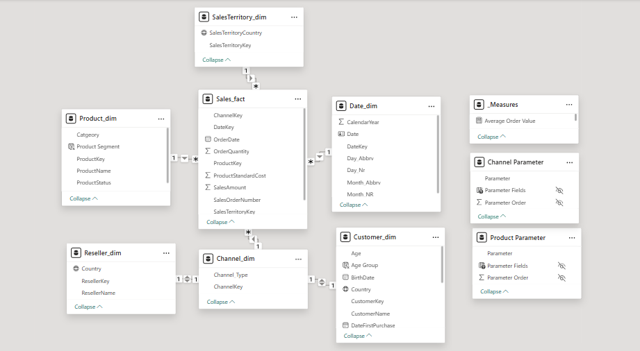

# AdventureWorks Sales Analytics Report

A comsprehensive Power BI analytics Report for sales performance tracking, product analysis, and customer segmentation using the AdventureWorks data warehouse.


## Project Overview

This project delivers an interactive Power BI report analyzing sales , products and customers from AdventureWorks data warehouse. The report contains:

- **Sales Overview** - Revenue tracking, profit analysis, and channel performance
- **Product Performance** - Product profitability segmentation and category analysis
- **Customer Segmentation** - RFM segmentation and Demoghraphics insights

## Data Extraction and Preparation
The Following tables were extracted using SQL queries from the AdventureWorksDW2019 database:

- Sales Fact Table
```SQL
SELECT
	SalesOrderNumber,
	OrderDateKey AS DateKey,
	ProductKey,
	CustomerKey AS ChannelKey,
	SalesTerritoryKey,
	OrderQuantity,
	ProductStandardCost,
	SalesAmount,
	TaxAmt,
	CAST(OrderDate AS DATE) AS OrderDate
FROM FactInternetSales
WHERE OrderDate IS NOT NULL 
	AND Year(OrderDate) Between 2022 AND 2024
UNION ALL
SELECT 
	SalesOrderNumber,
	OrderDateKey AS DateKey,
	ProductKey,
	ResellerKey AS ChannelKey,
	SalesTerritoryKey,
	OrderQuantity,
	ProductStandardCost,
	SalesAmount,
	TaxAmt,
	CAST(OrderDate AS DATE) AS OrderDate
FROM 
FactResellerSales
WHERE OrderDate IS NOT NULL 
	AND Year(OrderDate) Between 2022 AND 2024 ;
```

- Date Dimension Table
```SQL
 SELECT 
	DateKey,
	FullDateAlternateKey,
	CalendarYear,
	LEFT(EnglishMonthName,3) AS Month_Abbrv,
	MonthNumberOfYear AS Month_NR,
	LEFT(EnglishDayNameOfWeek,3) AS Day_Abbrv,
    DayNumberOfWeek AS Day_Nr
FROM DimDate 
WHERE YEAR(FullDateAlternateKey) BETWEEN 2022 AND 2024 ;
```

- Product Dimension Table
```SQL
SELECT
	p.ProductKey,
	p.EnglishProductName AS ProductName,
	COALESCE(s.EnglishProductSubcategoryName, 'Others') AS Subcategory,
	COALESCE(c.EnglishProductCategoryName, 'Others') AS Catgeory,
	COALESCE(Status,'Outdated') AS ProductStatus
FROM DimProduct p
LEFT JOIN DimProductSubcategory s ON p.ProductSubcategoryKey = s.ProductSubcategoryKey
LEFT JOIN DimProductCategory c ON s.ProductCategoryKey = c.ProductCategoryKey 
WHERE FinishedGoodsFlag = 1 ;
```

- Channel Dimension Table
```SQL
SELECT
	ResellerKey AS ChannelKey,
	'Reseller' AS Channel_Type
FROM DimReseller
Union ALL
SELECT 
	CustomerKey,
	'Customer'
from DimCustomer ;
```


- Customer Dimension Table
```SQL
Select
	CustomerKey,
	CONCAT (FirstName,' ',LastName) AS CustomerName,
	BirthDate, 
	DATEDIFF(YEAR,BirthDate,GETDATE()) AS Age,
	CASE 
		WHEN Gender = 'M' THEN 'Male'	
		WHEN Gender = 'F' THEN 'Female'
		ELSE 'Not Specified'
	END AS Gender,  
	DateFirstPurchase,
	g.EnglishCountryRegionName AS Country  
From DimCustomer c
LEFT JOIN DimGeography g ON c.GeographyKey = g.GeographyKey ;
```


- Reseller Dimension Table
```SQL
Select 
	r.ResellerKey,
	r.BusinessType,
	r.ResellerName,
	g.EnglishCountryRegionName AS Country
From DimReseller r
LEFT JOIN DimGeography g ON r.GeographyKey = g.GeographyKey ;
```

- Sales Territory Dimension Table
```SQL
SELECT
	SalesTerritoryKey,
	SalesTerritoryCountry
FROM DimSalesTerritory ;
```

### Data Model
Star Schema Design:
- Fact Table: Sales_fact (Internet + Reseller sales combined)
- Dimensions: Date, Product, Customer, Reseller, Channel, Sales Territory




## Key DAX Measures

### Sales Metrics

```dax
Net Sales = 
    SUMX(
        Sales_fact,
        Sales_fact[SalesAmount] - Sales_fact[TaxAmt]
    )

Net Profit = [Net Sales] - [Total Cost]

Profit Margin = 
    DIVIDE([Net Profit], [Net Sales], 0)
```

### Time Intelligence

```dax
PY Sales = 
VAR MaxYear = Max(Date_dim[CalendarYear])
VAR PrevYear = MaxYear - 1
RETURN
CALCULATE(
    [Net Sales],
    FILTER(ALL(Date_dim), Date_dim[CalendarYear] = PrevYear)
)

YoY % = DIVIDE([Net Sales] - [PY Sales], [PY Sales], 0)

MoM % = 
    VAR Curr = [Net Sales]
    VAR Prev =
        CALCULATE(
             [Net Sales],
            PREVIOUSMONTH('Date_dim'[Date])
        )
    RETURN
        IF(
            NOT ISBLANK(Prev) && Prev <> 0,
             DIVIDE(Curr - Prev, Prev)
         )
```

### RFM Segmentation

```dax
Recency = 
    DATEDIFF(
        MAX(Sales_fact[OrderDate]),
        TODAY(),
        DAY
    )

Frequency = COUNTROWS(Sales_fact)

Monetary = [Net Sales]

RFM Segment = 
    VAR R_Score = [Recency Score]
    VAR F_Score = [Frequency Score]
    VAR M_Score = [Monetary Score]
    RETURN
        SWITCH(
            TRUE(),
            R_Score >= 4 && F_Score >= 4 && M_Score >= 4, "Champions",
            R_Score >= 3 && F_Score >= 3, "Loyal Customers",
            R_Score >= 4 && F_Score <= 2, "Potential Loyalist",
            R_Score <= 2 && F_Score >= 3, "At Risk",
            R_Score <= 2 && F_Score <= 2 && M_Score <= 2, "Lost",
            "Need Attention"
        )
```


## Dashboards
### Sales Overview


- **KPI Cards**: Net Sales ($48.4M), Net Profit ($26.6M), Profit Margin (55%)
- **YoY Analysis**: Prior year comparisons with variance percentage
- **Trend Analysis**: Sales over time with Month-over-Month % change
- **Channel Performance**: Sales distribution across Reseller vs Customer channels
- **Geographic Filtering**: Country-level analysis capabilities

## Product Performance


- **Product Metrics**: Total products sold (183), Total quantity (166K)
- **Profitability Matrix**: Four-quadrant analysis (Star, Volume Driver, High Potential, Underperformer)
- **Category Analysis**: Quantity breakdown by subcategory and categoryy
- **Detailed Product Table**: demonstrate product profitability details

## Customer Segmentation 


- **Customer Metrics**: Total customers (18K), Total orders (21K), AOV ($706.6)
- **RFM Segmentation**: customer classification (Champions, Loyal, At Risk, Lost, etc.)
- **Demographic Analysis**: Age groups and gender distribution
- **Detailed Customer Table**: Individual-level recency, frequency, and monetary value


## Contact Information
- **Name**: Ziad Mohamed Soliman
- **Email**: ziad.mohamed17.1@gmail.com
- **LinkedIn**: [Ziad Soliman](https://linkedin.com/in/ziadsoliman)

## Resources
- [AdventureWorksDW2019 Database](https://learn.microsoft.com/en-us/sql/samples/adventureworks-install-configure?view=sql-server-ver17&tabs=ssms)